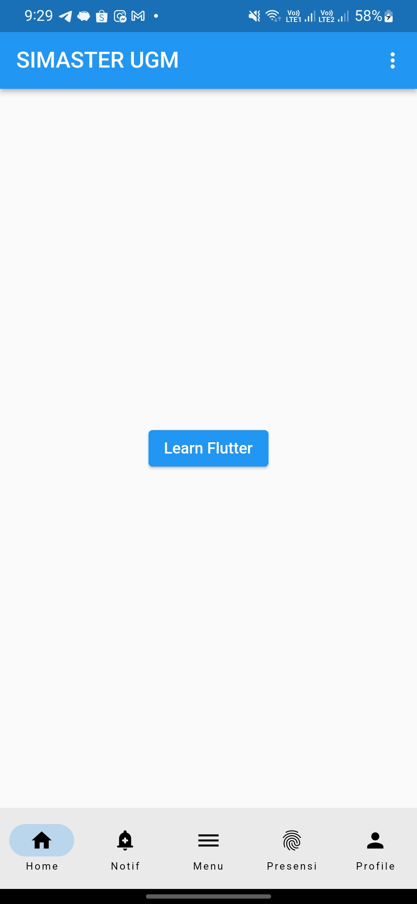

# (Deliverables) Mobile App Development Assignment GDSC UGM Hacker Role Member

This Flutter project aims to recreate the Simaster UGM (Sistem Informasi Manajemen dan Administrasi Terpadu) app, providing a simplified version for educational purposes. Simaster UGM is a comprehensive information system used by Universitas Gadjah Mada (UGM) to manage and administer various aspects of academic and administrative activities.

## Getting Started

This project is a starting point for a Flutter application.

A few resources to get you started if this is your first Flutter project:

- [Lab: Write your first Flutter app](https://docs.flutter.dev/get-started/codelab)
- [Cookbook: Useful Flutter samples](https://docs.flutter.dev/cookbook)

For help getting started with Flutter development, view the
[online documentation](https://docs.flutter.dev/), which offers tutorials,
samples, guidance on mobile development, and a full API reference.

